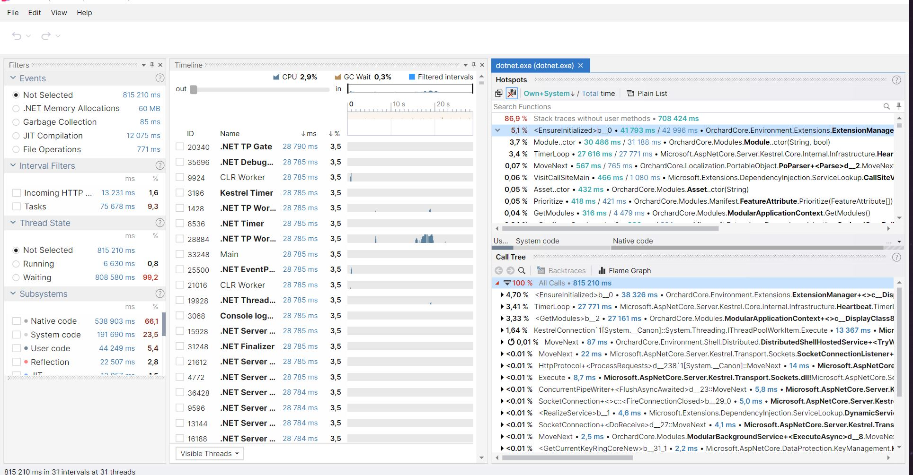
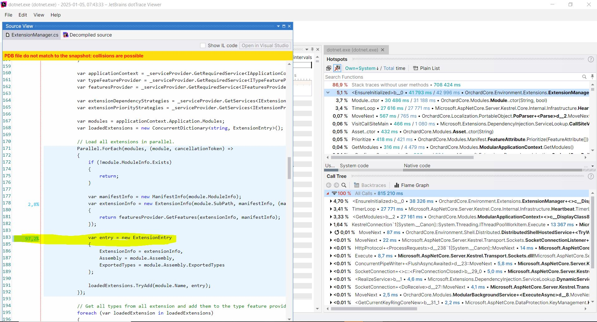
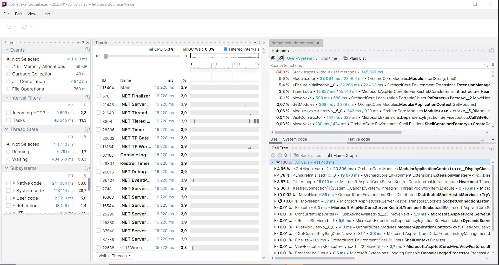
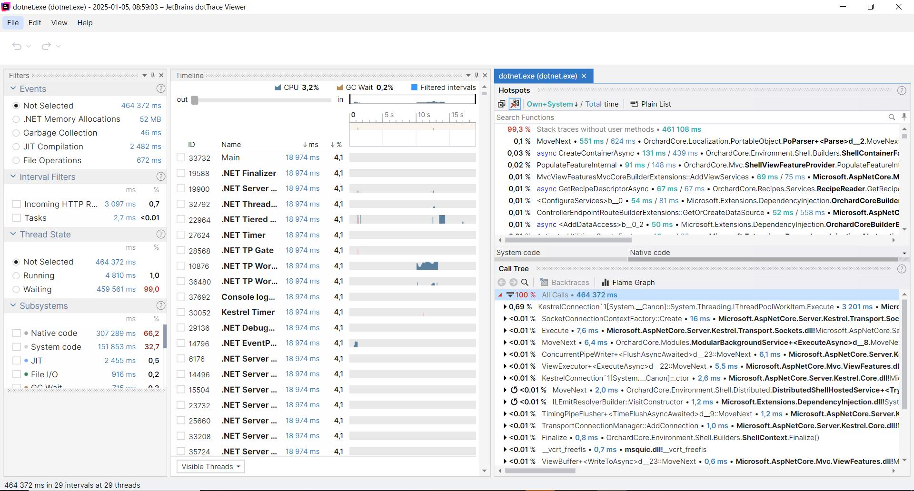

# Orchard Core Performance Improvement

Here is what I did in a sequence of steps:

1. I ran the dotnet profiler called dotTrace, and got the following results:

</img>
</img>

From the results, I found that the incoming HTTP request takes approximately 13 seconds. Additionaly, it was suggested that one of the slower tasks occurs when the `Parallel.ForEach` loop is executed within the `EnsureInitialized` function (see `ExtensionManager.cs`).

2. My first approach was to read up on parallelization, and I found some useful [resources](https://learn.microsoft.com/en-us/dotnet/standard/parallel-programming/how-to-speed-up-small-loop-bodies) that stated the following:

> When a Parallel.For loop has a small body, it might perform more slowly than the equivalent sequential loop, such as the for loop in C# and the For loop in Visual Basic. Slower performance is caused by the overhead involved in partitioning the data and the cost of invoking a delegate on each loop iteration. To address such scenarios, the Partitioner class provides the Partitioner.Create method, which enables you to provide a sequential loop for the delegate body, so that the delegate is invoked only once per partition, instead of once per iteration.

3. So in order to speed up the `Parallel.For` I used partitioning, and changed the code to:

```C#
var partitioner = Partitioner.Create(modules);
            ParallelOptions options = new()
            {
                MaxDegreeOfParallelism = System.Environment.ProcessorCount
            };
            // Load all extensions in parallel.
            Parallel.ForEach(partitioner, options, (module, cancellationToken) =>
            {
                if (!module.ModuleInfo.Exists)
                {
                    return;
                }

                var manifestInfo = new ManifestInfo(module.ModuleInfo);
                var extensionInfo = new ExtensionInfo(module.SubPath, manifestInfo, (manifestInfo, extensionInfo) =>
                {
                    return featuresProvider.GetFeatures(extensionInfo, manifestInfo);
                });

                var entry = new ExtensionEntry
                {
                    ExtensionInfo = extensionInfo,
                    Assembly = module.Assembly,
                    ExportedTypes = module.Assembly.ExportedTypes
                };

                loadedExtensions.TryAdd(module.Name, entry);
            });
```

and got the following results:
</img>

4. However, this change did not provide the performance boost I was expecting (incomin http-request takes approximately 9 seconds), and it didn’t feel like sufficient evidence that performance had actually improved. I began to consider that I might be approaching the problem too narrowly and should take a broader perspective. When is the `EnsureInitialized` function being called? What does it do? What other functions depend on it?

I realized that the `ExtensionManager` is added as a service, meaning it is injected via dependency injection and is created when the application initializes. I also noticed that the `EnsureInitialized` function is responsible for initializing values within the `ExtensionManager`. This led me to think it might be a good idea to trigger the function within the constructor of `ExtensionManager`, so the initialization process is handled during dependency injection. I updated the constructor accordingly:

```C#
public ExtensionManager(
    IServiceProvider serviceProvider,
    ILogger<ExtensionManager> logger)
{
    _serviceProvider = serviceProvider;
    L = logger;
    EnsureInitialized();
}
```

and got the following results from the profiler:
</img>

The new results from the profiler looked more promising, with the time for an incoming HTTP request now reduced to approximately 3 seconds.

## Obstacles and Things that can be improved further
There was a lot of obstacles that I hade to go through when working on this case, and there are some additional things that I wanted to improve, these are things that I would like to discuss more about during the technical interview discission.